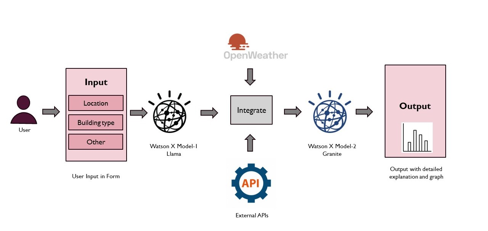

# CauseCoders - BuildBuddy: A Construction Helper Web Application using WatsonX

- [Project summary](#project-summary)
  - [The issue we are hoping to solve](#the-issue-we-are-hoping-to-solve)
  - [How our technology solution can help](#how-our-technology-solution-can-help)
  - [Our idea](#our-idea)
- [Technology implementation](#technology-implementation)
  - [IBM Watsonx.ai models used](#ibm-ai-services-used)
  - [IBM service used](#ibm-service-used)
  - [Other IBM technology used](#other-ibm-technology-used)
  - [Other tech used](#other-tech-used)
  - [Solution architecture](#solution-architecture)
- [Presentation materials](#presentation-materials)
  - [Solution demo video](#solution-demo-video)
  - [Project development roadmap](#project-development-roadmap)
- [Additional details](#additional-details)
  - [How to run the project](#how-to-run-the-project)
- [About us](#contributing)

## Project summary

### The issue we are hoping to solve

In India and globally, equitable access to land for construction poses significant challenges, leading to disparities in housing quality, safety, and overall living conditions. The lack of access to suitable land affects marginalized communities disproportionately, resulting in inadequate housing solutions and perpetuating cycles of poverty. Addressing these issues is essential to ensure safe and sustainable living environments for all, while promoting social equity and community resilience. 

### How our technology solution can help

Our solution uses IBM’s Watsonx, advanced AI models, Python, and real-time data from the OpenWeatherMap API to generate a comprehensive score for critical construction parameters. This ensures that factors like weather conditions are considered, promoting equitable and safe land access for construction projects. 

### Our idea 

In response to the pressing challenges of equitable access to land for construction, we have developed an innovative solution leveraging IBM’s Watsonx and its suite of AI services. This cutting-edge application utilizes predictive modeling to generate a comprehensive score-based output for various critical parameters that must be considered prior to building construction.
By integrating advanced AI capabilities, our solution not only streamlines the decision-making process but also ensures that essential factors are meticulously evaluated. 

 

## Technology implementation

### IBM Watsonx.ai models used :

- **ibm/granite-13b-chat-v2**: This model supports natural language understanding and facilitates human-like conversation for interactive decision-making. 

- **meta-llama/llama-3-8b-instruct**: This model provides advanced instruction-following capabilities, offering intelligent recommendations based on parameters. 

### IBM service used :  

- **IBM Watsonx Text-to-Speech**: We integrated the text-to-speech functionality of Watsonx to convert the text-based output into an audible format for better accessibility, which we even used for demo video creation.

### Other IBM technology used :

- **IBM Cloud**: Used to host and deploy the AI models, providing the necessary infrastructure to handle computational workloads and ensure scalable performance for the solution. 

- **IBM Watson Studio**: Utilized for model training, data preprocessing, and analysis, improving the prediction accuracy of construction parameters by providing a collaborative environment for data scientists and developers. 

- **IBM Watson Prompt Lab**: Leveraged for creating and refining AI prompts that optimize the interaction between the user and the AI model. This tool helps generate more accurate and relevant responses by allowing developers to test and customize AI prompts, enhancing the solution's decision-making process. 

### Other tech used : 

- **Python**: Python which is a versatile programming language that we used for integrating AI models, handling data processing, and making API calls. Its simplicity and wide range of libraries make it ideal for developing AI-driven solutions and building scalable, efficient applications. 

- **OpenWeather API**: The OpenWeather API provides real-time weather data, forecasts, and historical weather information. We integrated it into our solution to gather essential environmental parameters, such as temperature, humidity, and precipitation, which play a critical role in determining construction feasibility and ensuring safety for land access.

### Solution architecture

Diagram and step-by-step description of the flow of our solution:

1. The user navigates to the site and fills the form for details.
2. Watsonx AI LLAMA Model will processes the data and extracts the relevant information.
3. Watsonx AI granite Model will process data and predict the detailed output.
4. As a output it will give detailed explanation with score and graph.

## Presentation materials

### Solution demo video

)

### Project development roadmap
The project currently does the following things.

- Predict the score for construction of building
- Give detailed explaination for score
- Create graph for score

## Additional details

### How to run the project

- Clone the project
- Install required python dependencies from requirements.txt
- Generate and modify key for OpenWeather API
- Generate and modify Key for WatsonX AI
- Run the application

---

## About us 

# CauseCoders

## Team Members

- Siddhesh Prabhu
- Stuti Wali
- Shubham Garud
- Somesh Lad
- Apoorva Sahu

## Purpose
This document highlights the unique strengths of each team member and promotes a sense of unity within our group.

## Contributions
If you have any additional ideas or suggestions for names, please share them with the team!

## License
Feel free to use or modify this document for your own team-building efforts.
